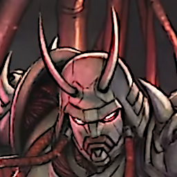

# Moonrider Android

<p align="center">
  
</p>

Porte Android de **Vengeful Guardian: Moonrider** (jogo Construct 2/HTML5) para
um APK universal via WebView nativo. Empacota o mesmo app Construct 2 usado no
porte muOS/PortMaster (`../portsmaster_on_rg40xxh/`), mas no Android **toda a
infraestrutura de contorno do muOS desaparece**: sem WPE WebKit, sem backend
Mali-fbdev, sem audio-ghost, sem mixer miniaudio nativo, sem bridge evdev.

O WebView (Chromium do sistema, atualizável a partir do Android 5.0) resolve
nativamente os três problemas-raiz que consumiram o porte muOS:

| Problema no muOS | Solução no Android |
|---|---|
| decode de `.ogg` travava o WebProcess | WebView toca `<audio>`/WebAudio nativo |
| present/frame_complete quebrado (3 FPS) | SurfaceFlinger + compositor Chromium |
| input via evdev + latch anti-borda | Gamepad API nativa do Chromium |

## Alvo

- **APK universal**: detecta gamepad físico (handheld Android, controle BT) e,
  quando não há, mostra um overlay touch on-screen.
- **minSdk 21 (Android 5.0)**, targetSdk 34.
- Orientação landscape, immersive fullscreen, tela sempre acesa.

## Arquitetura

```
assets/www/               <- app Construct 2 (mesmo do porte muOS)
  index.html              <- adaptado: sem alert file://, viewport fullscreen,
                             injeta touch-controls.js, SW desabilitado
  touch-controls.js       <- overlay touch -> dispara os keycodes NATIVOS do jogo
  c2runtime.js, data.js   <- runtime + event sheet originais (intocados)
  jquery-3.4.1.min.js
  media/*.ogg (283)       <- áudio
  images/ (1260)          <- sprites
src/.../MainActivity.java  <- WebView fullscreen, hardware-accel, immersive
src/.../LoggingChromeClient.java <- console JS -> logcat
AndroidManifest.xml        <- minSdk21, landscape, gamepad opcional
build.sh                   <- build manual (aapt2+javac+d8+zipalign+apksigner)
```

### Controles

O jogo já suporta teclado nativamente. Mapa default (de `data.js`
`varConKB_DEFAULT`/`_MENU`):

```
↑=38  ↓=40  ←=37  →=39
Z=90  X=88  S=83  A=65  C=67  Y=89   Enter=13 (confirmar menu)
```

- **Gamepad físico**: lido direto pela Gamepad API do C2 (`navigator.getGamepads`).
  O overlay touch some automaticamente quando um gamepad conecta.
- **Touch**: `touch-controls.js` sintetiza `keydown`/`keyup` reais desses
  keycodes — sem tocar no engine. Layout: D-pad à esquerda, botões A/B/X/Y à
  direita, START/SEL no topo.

## Distribuir como patch (sem assets comerciais)

Este repositório versiona **apenas o código do port** — nenhum asset do jogo. A
engine (`c2runtime.js`) e os dados (`data.js`) são **idênticos ao original**, então
o "patch" se resume a 4 arquivos web + o wrapper Android. Quem tiver uma cópia
legítima do jogo monta o projeto com um comando:

```bash
./apply.sh /caminho/para/os/assets/do/jogo --build
# -> copia os assets do jogo, sobrepõe os overrides do port e gera o APK
```

A "pasta de assets do jogo" é onde ficam `c2runtime.js`, `data.js`, `media/`,
`images/`, os `.csv` e `asteristic_logo.mp4` — extraída do `app.asar`
(Steam/GOG) ou do build HTML5 original.

O que o port sobrepõe (em `dist/www-overrides/`):

| Arquivo | Original? | O que muda |
|---|---|---|
| `index.html` | modificado | viewport fullscreen, injeta os scripts do port, desabilita service worker; ver `dist/index.html.diff` |
| `settings.js` | **novo** | patches ao vivo (FPS cap, escala, áudio, CRT, brilho) |
| `options-menu.js` | **novo** | painel de opções ⚙ |
| `touch-controls.js` | **novo** | overlay touch |

`dist/index.html.diff` é o diff unificado contra o `index.html` original, para
auditoria/reaplicação manual.

## Build

Não usa Gradle (build manual enxuto). Requer o SDK local em `.android-sdk/`
(cmdline-tools + platform android-34 + build-tools 34.0.0), já instalado.

```bash
./build.sh
# -> build/Moonrider-debug.apk
```

## Instalar / testar

```bash
adb install -r build/Moonrider-debug.apk
adb logcat -s MoonriderJS   # ver console JS do jogo
```

## Notas

- Os assets são propriedade da JoyMasher/The Arcade Crew; **não versionar** o
  conteúdo de `assets/www/media` e `assets/www/images` publicamente.
- Saves usam `localStorage` (origin `file://`), persistente entre execuções.
- Ficheiros Electron/Steam (greenworks, main.js, node_modules, .mp4) foram
  deliberadamente omitidos: o código Steam no `c2runtime.js` é condicional a
  `runtime.isNWjs` (false num WebView), então nunca executa.
- APK ~127M por causa dos assets. Para reduzir: recomprimir `.ogg`/sprites.

## Versões oficiais vs. os assets locais

Verificação nas lojas oficiais (jul/2026) comparada aos assets Construct 2/HTML5
usados por este port (a sua cópia local do jogo):

| | Steam | GOG | Assets locais (este port) |
|---|---|---|---|
| AppID / SKU | 1942010 | vengeful_guardian_moonrider | — |
| Release | 12 Jan 2023 | 12 Jan 2023 | — |
| Dev / Pub | JoyMasher / The Arcade Crew | idem | idem (package.json) |
| Idiomas | **10** (EN, FR, IT, DE, ES, +5) | **10** ("English & 9 more") | **10** CSVs `mrlang*` ✓ |
| Plataforma | Win nativo | Win nativo (DRM-free) | **HTML5/Construct 2** (NW.js) |
| Achievements | 13 (Steam) | — (GOG Galaxy) | presentes no event sheet |
| Versão | não exposta publicamente¹ | não exposta | `package.json` = 1.0.0² |

¹ SteamDB (patchnotes/buildid) está bloqueado por bot-detection; não deu para
  extrair o changelist exato sem login.
² `1.0.0` é o valor genérico do wrapper NW.js, **não** reflete patch do jogo. Não
  há número de versão do *jogo* embutido nos assets (Construct 2 não grava build
  id no `c2runtime.js`/`data.js`). O `1.4.x` que aparece num grep é versão de
  dependências npm (fs-extra etc.), não do jogo.

**Conclusão da comparação:** os assets locais são do **mesmo jogo** das lojas
oficiais — mesma data, mesmos 10 idiomas, mesmo dev/pub — na forma do **build web
Construct 2 (NW.js/Electron)** em vez do executável Windows nativo das lojas. Por
baixo, Steam/GOG rodam o mesmo `c2runtime.js` + `data.js`; a diferença é só o
runtime que os embrulha (NW.js aqui vs. o wrapper nativo das lojas). É por isso
que este port WebView funciona: ele descarta o wrapper NW.js/Steam e serve os
mesmos assets Construct 2 no WebView do Android. **Não foi possível confirmar se
os assets correspondem ao patch *mais recente*** das lojas (sem acesso a buildid),
mas o conteúdo (10 locales, event sheet com achievements/remap) é o do lançamento
completo, não uma demo.

### Integridade dos assets (SHA-256)

`dist/assets.sha256` guarda os hashes SHA-256 dos arquivos essenciais do jogo
(engine, dados, CSVs de idioma, intro) mais os hashes agregados das pastas
`media/` (287 arquivos de áudio: 283 .ogg + 4 .m4a) e `images/` (1260 arquivos). Serve para confirmar que a sua
cópia de assets está íntegra e é a mesma esperada por este port, sem redistribuir
nenhum conteúdo comercial. O `apply.sh` roda essa verificação automaticamente
(aviso não-fatal se divergir). Manual:

```bash
cd /caminho/para/os/assets/do/jogo
sha256sum -c /caminho/para/dist/assets.sha256
```

## Pendente (validação em device real)

✅ **Validado em device real** (POCO X3 Pro / vayu, LineageOS, Android 13):
tela de título renderiza (WebGL/Adreno), áudio toca (AAudio player USAGE_MEDIA
started), overlay touch completo com os 4 shoulders (L1/L2 topo-esq, R1/R2
topo-dir). Ver `docs/RELATORIO-SESSAO-20260714.md`.

### Pitfall crítico: vídeo de intro é OBRIGATÓRIO
O jogo abre com o vídeo `asteristic_logo.mp4` (plugin Video do C2). Se ele
faltar, o app fica em **tela preta e sem som** — o C2 espera o vídeo terminar
antes de avançar ao menu, e é o primeiro user-gesture/mídia que destrava o
contexto de áudio do WebView. **Sempre copiar `asteristic_logo.mp4` (3.9MB)**
para `assets/www/`. O `testdemo.mp4` (217MB, attract/demo) é opcional.

## Menu de opções ao vivo (⚙)

Botão de engrenagem no canto superior direito abre um painel que aplica tudo
**ao vivo** (JavaScript) e salva em `localStorage`:

| Opção | Efeito |
|-------|--------|
| Trava de FPS | 30 / 60 / 90 / 120 / Sem trava **+ botão `…` para valor custom (10–240)** — gate por-callback no requestAnimationFrame (medido: cap 30→30fps, 60→60fps) |
| Escala | Off / Auto / 50 / 100 / 200 / 300 / 400 / 500% **+ botão `…` para % custom (25–1000)** da resolução nativa 428×240 (pixels perfeitos; medido: 100%→428px, 200%→856px, 500%→2140px) |
| Suavização de pixels | nearest (nítido) vs linear |
| Volume | 0–100% (GainNode master no WebAudio) |
| Áudio | Estéreo / Mono (downmix real via channel merger) |
| Mostrar FPS | Contador no topo |
| Filtro CRT | Scanlines retrô |
| Brilho | 50–150% |
| Vibração | Haptics nos botões touch |
| Manter tela acesa | Bridge nativo FLAG_KEEP_SCREEN_ON |
| Forçar overlay touch | Botões visíveis mesmo com gamepad |
| **Sair do jogo** | Fecha o app (Activity.finish) via bridge nativo — o "Quit" do menu do jogo chama uma API NW.js/Electron inexistente no WebView e não funciona |

Arquivos: `assets/www/settings.js` (patches de API, carregado ANTES do
c2runtime) + `assets/www/options-menu.js` (UI). Abrir o menu pausa o jogo.

> Valores custom: as linhas **Trava de FPS** e **Escala** têm um botão `…` que
> abre um campo numérico inline — digite qualquer valor (Enter confirma, Esc
> cancela). O chip fica destacado mostrando o valor custom ativo.

## Sair do app

- **Botão "Sair do jogo"** no menu ⚙ (confirmação de dois toques) → `Activity.finish()` via bridge nativo.
- **Voltar (Back) duplo**: um toque em Voltar mostra um aviso; um segundo toque
  em até 2s fecha o app. Válvula de segurança caso o menu/bridge falhe — o
  usuário nunca fica preso. (O "Quit" do menu *do jogo* não funciona: chama uma
  API NW.js/Electron inexistente no WebView.)

## Roadmap / To-dos

Investigação técnica feita sobre `c2runtime.js` + `data.js` (event sheet) para
avaliar viabilidade de cada item:

### 1. i18n do menu custom (nosso overlay) — FÁCIL
Hoje `options-menu.js` tem as strings em **PT hardcoded**. Plano:
- Extrair as strings para um dicionário `MR_I18N[lang]` em `settings.js`.
- Idiomas a cobrir (espelhar os 10 nativos do jogo): pt, en, ja, de, fr, es,
  zh-Hans, zh-Hant, ko, it.
- Escolher o idioma do menu pelo mesmo valor usado para o jogo (ver item 2),
  com fallback para `en`.
- Esforço: baixo. Risco: nenhum (só nosso código).

### 2. Trocar o idioma interno do jogo — VIÁVEL (raiz identificada)
**Causa:** o jogo não tem seletor próprio. Ele lê `navigator.language` (via a
expressão C2 "Language") para uma variável `windowsLanguage` e compara o prefixo
contra `pt/en/ja/de/fr/es/zh/ko/it`, carregando o CSV correspondente
(`moonriderloc-mrlang{us,ptbr,jp,de,fr,es,chs,cht,kr,it}.csv`). No Android o
`navigator.language` = locale do sistema, **sem como trocar dentro do jogo**.
**Plano:** em `settings.js` (carregado ANTES do `c2runtime.js`), sobrescrever
`navigator.language`/`navigator.languages` com o idioma salvo, e recarregar a
página ao trocar (o idioma é lido só na inicialização). Adicionar uma linha
"Idioma do jogo" no menu ⚙ com os 10 valores.
- Esforço: médio (precisa reload + mapear código→prefixo). Risco: baixo — não
  altera engine, só o valor lido no boot. **Validar:** cada CSV realmente carrega
  ("CSV loaded successfully!" no logcat) e as fontes CJK renderizam no WebView.

### 3. Submenu interno de gamepad / remap — INVESTIGAR
O event sheet tem `remap` (37x) e `ConKB` (config de teclado) — ou seja, **o
jogo já possui remapeamento**. Falta confirmar se o menu de controles abre e é
navegável via gamepad físico no WebView (a Gamepad API entrega os eventos, mas o
menu pode depender de input de teclado que o overlay/gamepad não sintetiza).
**Plano:** abrir Options→Controls in-game com gamepad e observar; se não navegar,
mapear os botões do gamepad para os keycodes que o menu espera (reusar a ponte de
`touch-controls.js`). Se o remap nativo funcionar, documentar; senão, expor um
remap simples no nosso overlay.
- Esforço: médio/incerto até testar em device. Risco: médio.

### 4. Cheats / hacks úteis — PARCIALMENTE VIÁVEL
As variáveis globais do C2 são acessíveis via `c2runtime` no console/JS. Candidatos
de baixo risco (dev/acessibilidade, opt-in e avisados):
- **Vida infinita / no-damage**: localizar a variável de HP do player no event
  sheet e forçá-la a cada tick (patch periódico via `settings.js`).
- **Slow-mo / turbo**: já temos controle de FPS; um multiplicador de `dt` daria
  slow-motion de acessibilidade.
- **Level select / unlock**: se houver flag de progresso em `localStorage`.
Estes dependem de mapear variáveis específicas no `data.js` (trabalhoso, nomes
ofuscados). **Plano:** começar por slow-mo (já temos a base de tempo) e um toggle
de invencibilidade se a var de HP for localizável. Marcar claramente como
"cheats" e desligados por padrão.
- Esforço: alto (engenharia reversa do event sheet). Risco: médio.

Prioridade sugerida: **1 → 2 → 3 → 4** (do mais barato/seguro ao mais incerto).

## Legal

O código deste port está licenciado sob a **Apache License 2.0** — veja
[`LICENSE.md`](LICENSE.md) e [`NOTICE`](NOTICE).

Este repositório contém **apenas** o código do port (WebView wrapper + overlays
JS/HTML), sob o autor. **Nenhum asset do jogo é incluído ou redistribuído** —
`c2runtime.js`, `data.js`, áudio, sprites, CSVs e ícones do jogo são propriedade
da **JoyMasher / The Arcade Crew** e devem ser fornecidos por quem possui uma
cópia legítima (`apply.sh`). O `.gitignore` bloqueia todo esse material. A licença
Apache 2.0 cobre **somente** o código autoral do port, não o jogo (ver `NOTICE`).
Projeto não-oficial, sem afiliação com a JoyMasher / The Arcade Crew.

### Ícone do app

O ícone do launcher (`res/mipmap-*/ic_launcher.png`, veja `docs/icon.png`) é a
arte custom do Moonrider, gerada nas 5 densidades a partir de um PNG 256×256. Para
trocar,
substitua os PNGs nas 5 densidades (mdpi 48px, hdpi 72, xhdpi 96, xxhdpi 144,
xxxhdpi 192) e rebuilde. Se usar arte oficial do jogo, mantenha-a fora do git.
